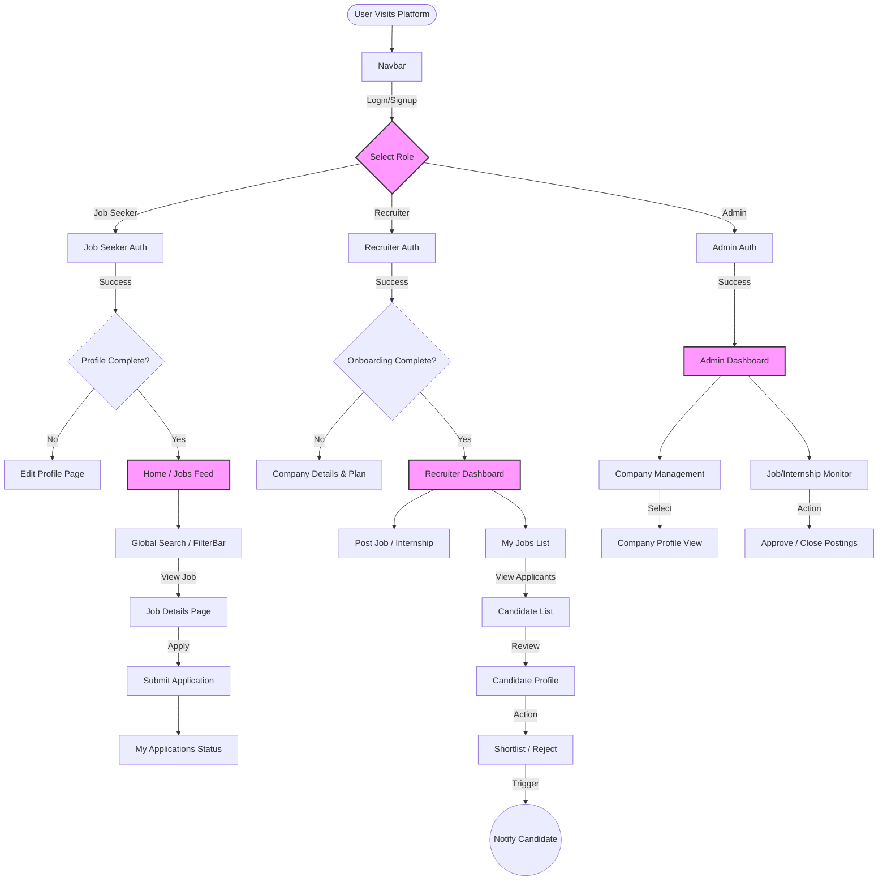

# Application Methodologies & Flows

## Recruiter Flow Explanation

The Recruiter workflow is designed to be streamlined, guiding the user from account creation to successfully hiring a candidate.

1.  **Authentication & Onboarding**:
    *   **Sign Up/In**: Recruiters access the platform via a dedicated portal (`/auth/recruiter`).
    *   **Onboarding**: New recruiters *must* complete an onboarding flow where they provide Company Details (Name, Size, Logo) and select a Subscription Plan (Free tier for prototype).
    *   **Company Linking**: If the recruiter's email matches an existing company domain or invitation, they are linked; otherwise, a new Company profile is created.

2.  **Dashboard Access**:
    *   Once onboarded, they land on the **Recruiter Dashboard**.
    *   This central hub provides quick access to "Post a Job", "Post an Internship", and view recent variations.

3.  **Posting Opportunities**:
    *   **Jobs**: Recruiters can create detailed job postings with salary, location, and requirements.
    *   **Internships**: Dedicated flow for internships including stipend and duration details.
    *   **Status**: Posts can be saved as Drafts or published directly to "Active" status.

4.  **Candidate Management**:
    *   **Overview**: The "Candidates" page (`/recruiter/candidates`) displays a grid of all active postings with real-time applicant counts.
    *   **Scoped Review**: Clicking "View Applicants" on a specific job card opens a dedicated list (`/recruiter/candidates/[jobId]`) containing only applicants for *that* role.
    *   **Screening**: Recruiters can view candidate profiles (Resume, Experience) in a side-sheet without leaving the list.
    *   **Action**: Candidates can be marked as **Shortlisted** or **Rejected**. Shortlisting triggers an immediate in-app notification to the candidate.

---

## Application Flowchart

